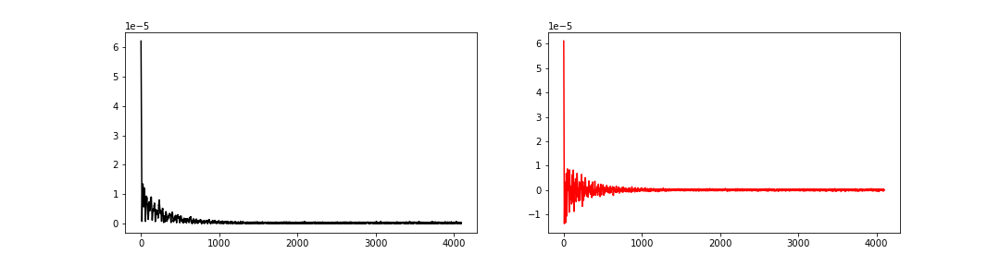
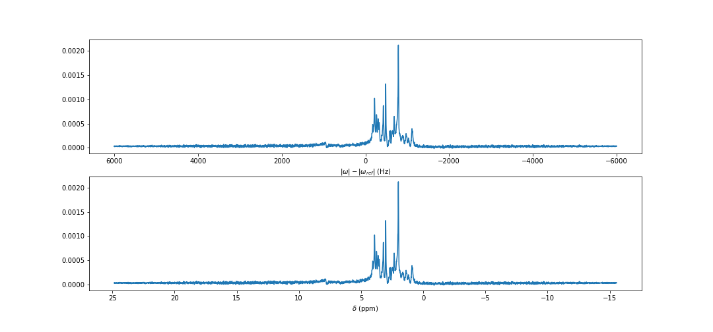

# NIfTI MRS import into Python
A demonstration of how to load the NIfTI MRS format in python using the nibabel libraries.

NIfTI MRS is a new standard for storing  magnetic resonance spectroscopy data. A description of the format can be found in [the online specification](https://github.com/wtclarke/mrs_nifti_standard/blob/master/specification.MD).

This readme file contains example code that can also be run interactively in `interactive_example.ipynb`.

## Setup
First, clone the NIfTI MRS standard repository

    git clone https://github.com/wtclarke/mrs_nifti_standard.git

and locate the example data in the `example_data` folder.

You will need the following python packages in addition to the built in `json` package:  
- nibabel
- numpy

## Loading a simple example
### Load the data

    nifti_mrs_file = 'svs_preprocessed.nii.gz';
    img = nib.load(nifti_mrs_file)

### Examine the data

    data = img.get_fdata(dtype=np.complex64)
    print(f'Data shape = {data.shape}')
<!-- break -->
    Data shape = (1, 1, 1, 4096)

### Plot the data

    fig,axes = plt.subplots(1,2,figsize=(15,4))
    axes[0].plot(np.abs(data[0,0,0,:]),color='k')
    axes[1].plot(np.real(data[0,0,0,:]),color='r')
    plt.savefig('plots/data.png')

### Examine the NIfTI header

    header = img.header
    print(f'intent_name: {header.get_intent()[2]}')
    print(f'Position information: \n {header.get_best_affine()}\n')

    dwelltime = header['pixdim'][4]
    print(f'Dwelltime: {dwelltime} s\n')

    print(header)
<!-- break -->
    intent_name: mrs_v0_2
    Position information: 
    [[ 20.          -0.          -0.         -32.90067836]
    [ -0.         -20.          -0.          10.6633755 ]
    [  0.           0.         -20.          21.35589036]
    [  0.           0.           0.           1.        ]]

    Dwelltime: 8.33e-05 s

    <class 'nibabel.nifti2.Nifti2Header'> object, endian='<'
    sizeof_hdr      : 540
    magic           : b'n+2'
    eol_check       : [13 10 26 10]
    datatype        : complex64
    bitpix          : 64
    dim             : [   4    1    1    1 4096    1    1    1]
    intent_p1       : 0.0
    intent_p2       : 0.0
    intent_p3       : 0.0
    pixdim          : [1.00e+00 2.00e+01 2.00e+01 2.00e+01 8.33e-05 1.00e+00 1.00e+00 1.00e+00]
    vox_offset      : 0
    scl_slope       : nan
    scl_inter       : nan
    cal_max         : 0.0
    cal_min         : 0.0
    slice_duration  : 0.0
    toffset         : 0.0
    slice_start     : 0
    slice_end       : 0
    descrip         : b''
    aux_file        : b''
    qform_code      : aligned
    sform_code      : aligned
    quatern_b       : 1.0
    quatern_c       : 0.0
    quatern_d       : 0.0
    qoffset_x       : -32.90067836
    qoffset_y       : 10.6633755
    qoffset_z       : 21.35589036
    srow_x          : [ 20.          -0.          -0.         -32.90067836]
    srow_y          : [ -0.        -20.         -0.         10.6633755]
    srow_z          : [  0.           0.         -20.          21.35589036]
    slice_code      : unknown
    xyzt_units      : 0
    intent_code     : none
    intent_name     : b'mrs_v0_2'
    dim_info        : 0
    unused_str      : b''

### Examine the NIfTI MRS header extension

    hdr_ext_codes = img.header.extensions.get_codes()
    mrs_hdr_ext = json.loads(img.header.extensions[hdr_ext_codes.index(44)].get_content())
    mrs_hdr_ext
<!-- break -->
    {'SpectrometerFrequency': [297.219948],
    'ResonantNucleus': ['1H'],
    'EchoTime': 0.011,
    'RepetitionTime': 5.0,
    'InversionTime': None,
    'MixingTime': 0.032,
    'ConversionMethod': 'Manual',
    'ConversionTime': '2020-12-16T17:14:47.920',
    'OriginalFile': ['meas_MID310_STEAM_metab_FID115673.dat']}

### Plot spectrum on frequency and ppm axis

    spectrometer_frequency = mrs_hdr_ext['SpectrometerFrequency'][0]
    bandwidth = 1/dwelltime
    frequency_axis = np.linspace(bandwidth/2, -bandwidth/2, data.shape[3])
    ppm_axis = 4.65+frequency_axis/spectrometer_frequency

    spectrum = np.fft.fftshift(np.fft.fft(data[0,0,0,:]))

    fig,(ax1,ax2) = plt.subplots(2,1,figsize=(15,7))
    ax1.plot(frequency_axis,np.real(spectrum))
    ax2.plot(ppm_axis,np.real(spectrum))

    ax1.invert_xaxis()
    ax2.invert_xaxis()

    ax1.set_xlabel('$|\omega|-|\omega_{ref}|$ (Hz)')
    ax2.set_xlabel('$\delta$ (ppm)')

    plt.savefig('plots/spectra.png')

## Load more complex SVS example

    nifti_mrs_file_2 = 'svs_suppressed.nii.gz';
    img2 = nib.load(nifti_mrs_file_2)

    print(f'Data shape: {img2.get_fdata(dtype=np.complex64).shape}')
<!-- break -->
    Data shape: (1, 1, 1, 4096, 32, 64)

### Use header extension to find out what the higher dimensions are used for

    hdr_ext_codes = img2.header.extensions.get_codes()
    mrs_hdr_ext2 = json.loads(img2.header.extensions[hdr_ext_codes.index(44)].get_content())
    mrs_hdr_ext2
<!-- break -->
    {'dim_5': 'DIM_COIL',
    'dim_6': 'DIM_DYN',
    'dim_6_use': 'Signal repetitions',
    'SpectrometerFrequency': [297.219948],
    'ResonantNucleus': ['1H'],
    'EchoTime': 0.011,
    'RepetitionTime': 5.0,
    'InversionTime': None,
    'MixingTime': 0.032,
    'ConversionMethod': 'Manual',
    'ConversionTime': '2020-12-16T17:14:47.920',
    'OriginalFile': ['meas_MID310_STEAM_metab_FID115673.dat'],
    'siemens_sequence_info': {'Description': 'Paths to sequence and reconstruction code binaries for sequence identification.',
    'sequence': '%CustomerSeq%\\uzay_steam_gui',
    'recon': '%CustomerIceProgs%\\uzayIcePrgSpecOnline'}}
